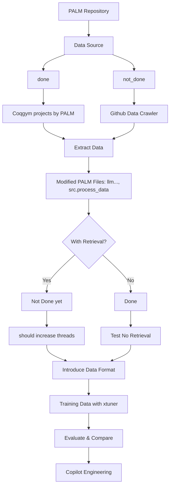

# Short Intro


## PALM Repository
PALM is a code base integrated with python and coq serapi to prove coqgym files.

How to run PALM code base?

see [PALMreadme](PALMreadme.md)

install additional instructions (you might face errors) see [install](install_experience.md)


## Github Data Crawler

Not start yet.

TODO: Github Coq project: Before 2024 for Training, After 2024 for Testing


## Coqgym projects by PALM 

Follow the instructions of PALM, and check the file [PALM/coq_projects](PALM/coq_projects). These are the data we are currently using

Coqgym have 66k theorems, PALM uses 10k.(PALM also support other projects)

## Modified Files: src.llm, src.process_data

To Wenjie(by Suozhi):

Here are the files and functions I modified in the PALM repo:

1. Added functions in [src/llm.py](src/llm.py) to support prompt without retrieval. 

    Previous prompt for general LLMs are with examples and retrieved premises.

    For SFT model, prompt format should be consistant.

2. Added files [src/sft_data.py](src/sft_data.py) and [src/process_whole_proof_data_retrieval.py](src/process_whole_proof_data_retrieval)

    src/sft_data.py: copy the structure of [main.py](src/main.py) but output: goals, hypos, def, premises[max_num_premises] to extract coqgym projects 

    src/process_whole_proof_data_retrieval.py: use the functions of [src/sft_data.py](src/sft_data.py) and combine other project in coqgym but not in PALM to generate SFT data(66k in total)


## Extract Data

I add a file [process_whole_proof_data_no_retrieval.py](process_whole_proof_data_no_retrieval.py)
This is extract SFT data but w/o retrieval so no need to interact with PALM but directly from Coqgym


## With Retrieval?

### w/ Retrieval

run 
```
python -m src.process_whole_proof_data_retrieval.py
```
Not done yet(should increase thread to accelerate)

### w/o Retrieval
run 
```
python process_whole_proof_data_no_retrieval.py
```


## Introduce Data Format

See [sft_data/whole_proof_sft_data](sft_data/whole_proof_sft_data) for sft data

example:

```
{
    "messages": [
      {
        "role": "user",
        "content": "Solve This Proof State:\n\nHypotheses:\n\nGoal:\n@monoid_theory nat nat_join O\n\n"
      },
      {
        "role": "assistant",
        "content": "```coq\nsplit; auto.\nQed.\n```"
      }
    ]
  },
```
Note again: the sft mini-model prompt format can't be wrong, the generic models llama, gpt can be organized in natural language.
## Training Data with xtuner

check this website: https://github.com/InternLM/xtuner/tree/main

config file for sft: [deepseek_prover whole proof config](deepseek_prover_whole.py)

train:

```
NPROC_PER_NODE=8 xtuner train deepseek_prover_whole.py --deepspeed deepspeed_zero1 --launcher pytorch
```

## Evaluate & Compare

Compare two models:

[SFT model(w/o retrieval) ](/home/suozhi/models/deepseek_prover_whole_1800iter/iter_1800_hf
) and  [llama3 8B instruct](meta-llama/llama3-8B-instruct)

Change [config](src/config.py) file MODEL

for each project (like hoare-tut):
```
python -m src.main --proj="hoare-tut" --exp_name="test" --threads=1 -backtrack

python -m src.main --proj="hoare-tut" --exp_name="llama8B_no_retrieval" --threads=1 -backtrack
```

I should write a evaluate python file for projects

## Copilot Engineering

Not Started yet


## Current Problems

1. Extract SFT format json files with retrieval premises takes a few days

2. Test no retrieval first
(our trained model and llama 8B instruct)
But some projects have errors like 'angles', 'coq-procrastination'.
See error details in Notion

