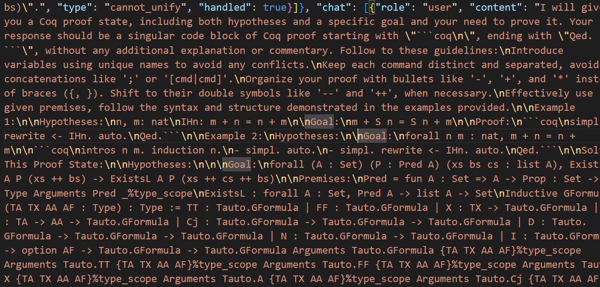

 # PALMcopilot

## Overview
PALMcopilot is an experimental project that integrates Coq and Python for interactive theorem proving. This project is based on the PALM framework and aims to enhance the capabilities of automated theorem proving by leveraging machine learning models.

## Table of Contents
- [Installation](#installation)
- [Usage](#usage)
- [Work Progress](#work-progress)
- [Future Work](#future-work)
- [Contributing](#contributing)
- [License](#license)

## Installation
To get started with PALMcopilot, follow these steps:

1. **Clone the repository:**
   ```bash
   git clone https://github.com/lachinygair/PALM
   
   git clone https://github.com/princeton-vl/CoqGym

   cd PALM


## Usage
PALM usage involves interacting with Coqgym files and Python(with Serapi) to extract premises, generate prompts, and input them into GPT-4o and Llama. Here are the basic steps:

## Prepare your Coq project:
Ensure your Coq project is structured correctly and all necessary files are included.

download all json files in coqgym: https://zenodo.org/records/8101883

## Extract data:
Use the provided scripts to extract premises, definitions, lemmas, and goals from your Coq project. 

## Generate prompts:
Use the extracted data to generate prompts for input into GPT-4o and Llama. 

See details in [llm.py](src/llm.py).



## Run inference:
Use the generated prompts to perform inference on new Coq proofs.

See details in [PALM README](README.md).

```
python -m src.main --proj="verdi" --exp_name="test" --threads=1 --resume="ours" -skip -backtrack -intersect
```

## Work Progress
### Current Status
#### Data Extraction:

Extracted Coqgym code and generated 66k whole proof data points (without premises and defs).
#### Model Fine-tuning:

Fine-tuned with Deepseek Prover (smaller models are preferred).

1. deepseek prover 1.5 base 替换deepseek coder 1.3b 结果好的多：
    1. epoch 5 loss 0.5, epoch 10 loss 0.3
    2. 训练数据成功拟合
### Next Steps


#### Data Organization: Organize two datasets:
One without premises and defs for comparison.
(现在PALM baseline 只有with premises and defs 的prompt结果)

One with the current PALM results and data trained with premises and defs for model comparison.
(现在我们新构造的sft数据 只有without premises and defs)
#### Model Integration:

Embed the model following the approach of CoqCopilot.
https://github.com/JetBrains-Research/coqpilot
### Future Work

#### Model optimization:
 Continue optimizing the model for better performance and accuracy.
#### Integration testing:
 Ensure seamless integration with Coq and SerAPI for real-world applications.